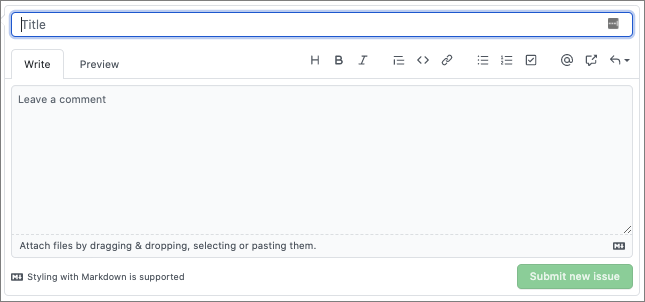
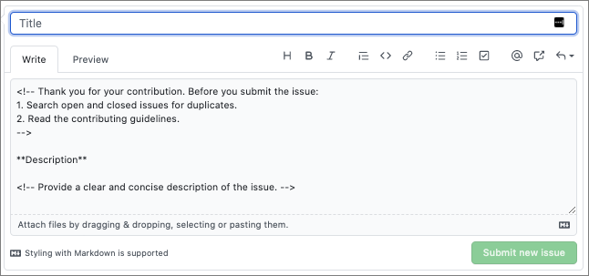
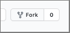
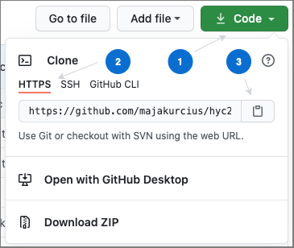
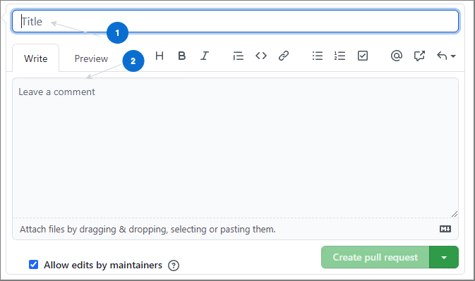

# Create a GitHub issue template

By default, when you open a new GitHub issue, it's blank. 



However, GitHub lets you define your own issue templates, which automatically populate a new issue of a given type with the text you predefine.
This way, you can tell the potential contributor what kind of information you need them to include, and how the issue description should be structured. This makes issue processing much easier! 

This is an example of a predefined issue in [Kyma](https://github.com/kyma-project/kyma):



You can have different predefined issue types, such as a bug, a feature request, a documentation improvement, a failing test, a support request, and others.

To open a new issue in the [`hyc2020-tw` repository](https://github.com/majakurcius/hyc2020-tw), go to GitHub and select **Issues** > **New issue**. If the repository has predefined issue types, you'll be able to choose from them now. If there aren't any, a blank issue will open automatically at this point. 

To add your own issue type, follow this guide.

> **NOTE:** You can also create new files, branches, commits, and pull requests (PRs) from the GitHub UI. This guide aims to show you how to do it from a command line interface (CLI).

## Prerequisites

To perform the following steps, you must have:
- a [GitHub](https://github.com) account
- [Git](https://git-scm.com/download/)
- a text editor/IDE (e.g. [Visual Studio Code](https://code.visualstudio.com/), [Atom](https://atom.io/))
- a terminal/command line

## Steps

To create a new issue type for the [`hyc2020-tw` repository](https://github.com/majakurcius/hyc2020-tw), follow these steps:

1. Go to the [`hyc2020-tw` repository](https://github.com/majakurcius/hyc2020-tw) and click **Fork**.

    
    
    GitHub will take you to the forked repository.
    
2. Clone the forked repository. Click **Code**, select the **HTTPS** tab, and copy the URL.

    
    
    > **TIP:** If you don't want to have to type in your password a lot, read about [cloning with SSH URLs](https://docs.github.com/en/free-pro-team@latest/github/using-git/which-remote-url-should-i-use#cloning-with-ssh-urls).
    
3. Open your terminal in the location where you want to clone the Git repository, and clone the repo. Replace `{THE_URL_YOU_COPIED_IN_STEP_2}` with the actual URL and run this command in the terminal:

    ```bash
    git clone {THE_URL_YOU_COPIED_IN_STEP_2}
    ```
   
4. Navigate to the repository and create a new branch. Replace `{NAME_OF_YOUR_BRANCH}` with your own name of the branch.

    ```bash
    git cd hyc2020-tw
    git checkout -b {NAME_OF_YOUR_BRANCH}
    ```
   
5. Open your text editor or IDE of choice. If you use an IDE, open the repository as a project.

6. Create a new `{ISSUE_TYPE_NAME}.md` file in the `hyc2020-tw/.github/ISSUE_TEMPLATE` directory. Replace `{ISSUE_TYPE_NAME}` in the file name with your own issue type name.

7. Use Markdown to create a new issue template in this file. If you need inspiration, see the [issue templates in Kyma](https://github.com/kyma-project/kyma/tree/master/.github/ISSUE_TEMPLATE).

8. Save the file.

9. Add the changes to the staging area, so they are taken into account when you commit your changes.

    ```bash
    git add .
    ``` 
   
10. Commit the changes. Replace `{COMMIT_MESSAGE}` with a short description of your changes, e.g. `Add a new issue template`.

    ```bash
    git commit -m "{COMMIT_MESSAGE}"
    ```

11. Push the changes to Git. 

    ```bash
    git push
    ```
    
    > **NOTE:** If this is your first push to this branch, you'll be prompted to set the upstream for it and run `git push --set-upstream origin {YOUR_BRANCH_NAME}` instead.
                
12. After you run set the upstream, you'll get a link to create a PR. If you don't want to create a PR right away, you may do so later from the GitHub UI. Otherwise, copy the link from the terminal and open it in your browser.

13. Fill in the PR title and provide a short description of the changes you made. If you need examples, see [PRs in Kyma](https://github.com/kyma-project/kyma/pulls).

    
    
14. Click on **Create pull request**. Congratulations! You just created your first PR!

For your changes to be published, your PR needs to be reviewed and approved by the content owner(s). If you want me to take a look, or have other questions, send me an email (`maja.kurcius_at_sap_dot_com`) or add the `help wanted` label to your PR.~~~~ 